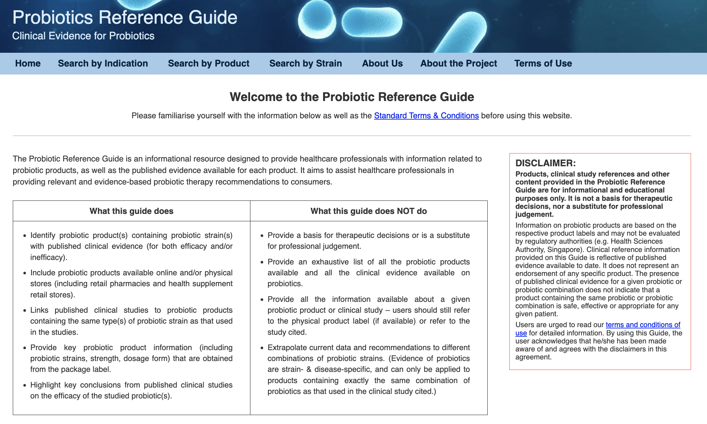
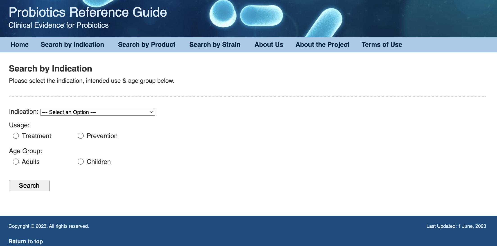
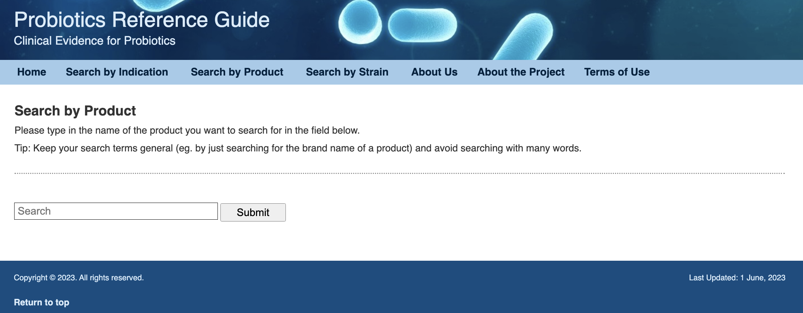
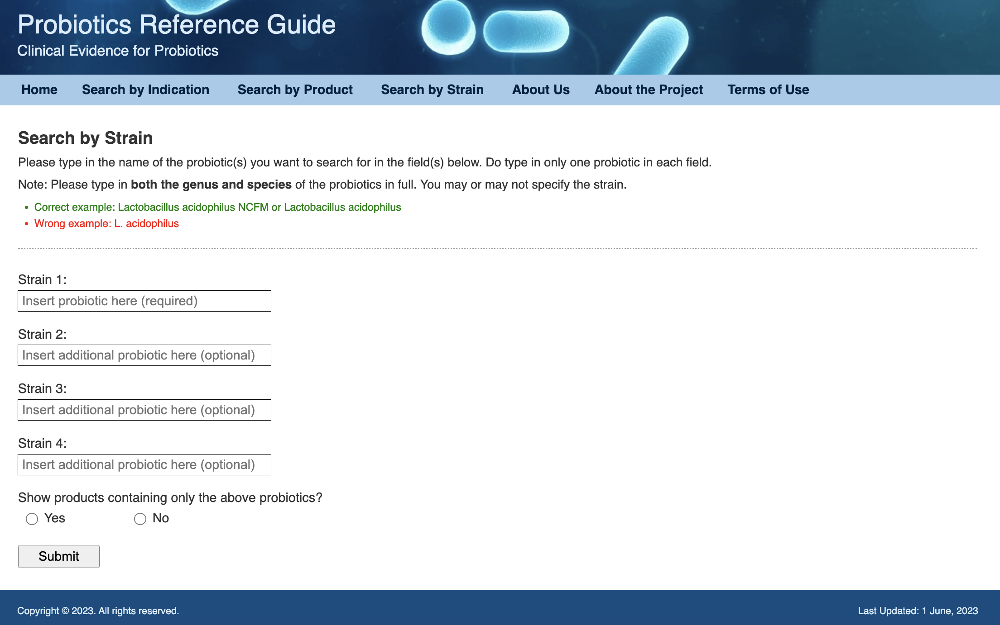
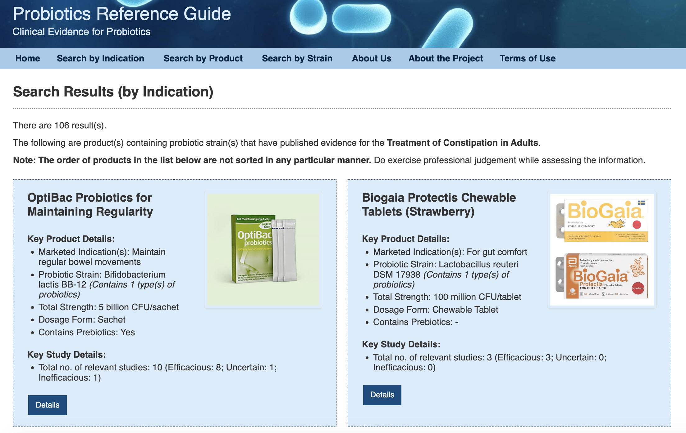
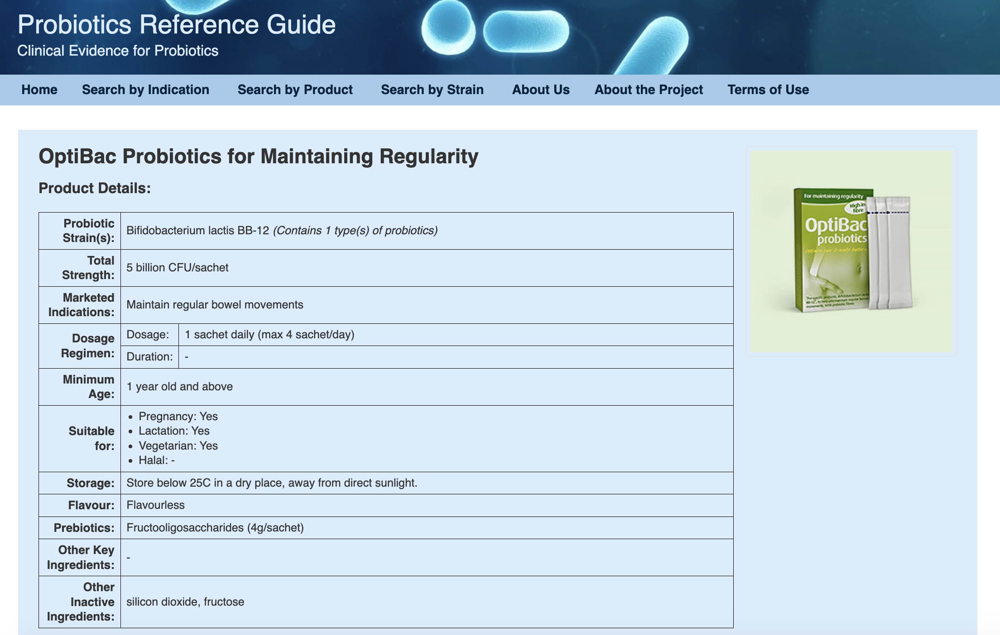
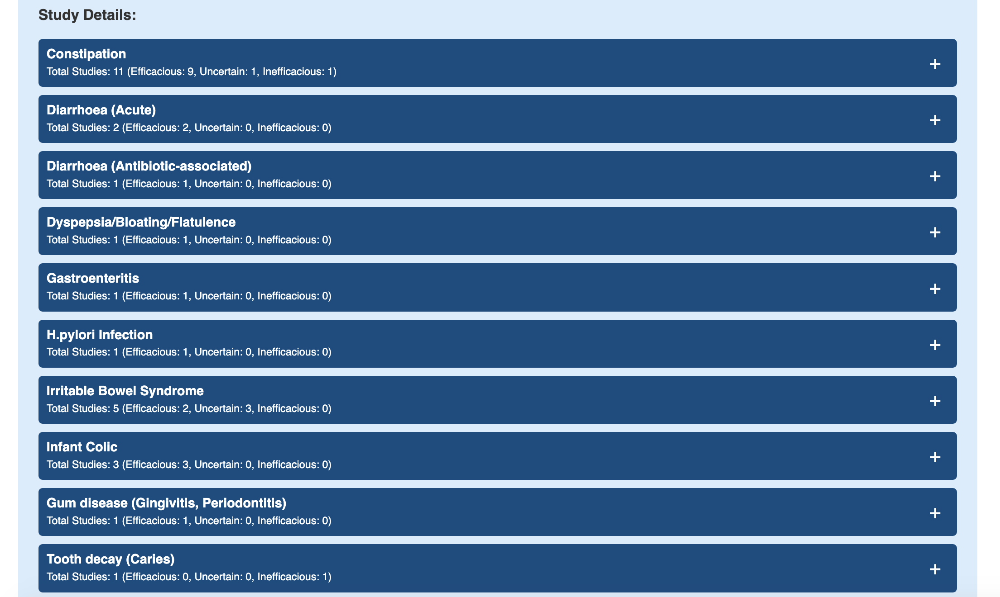
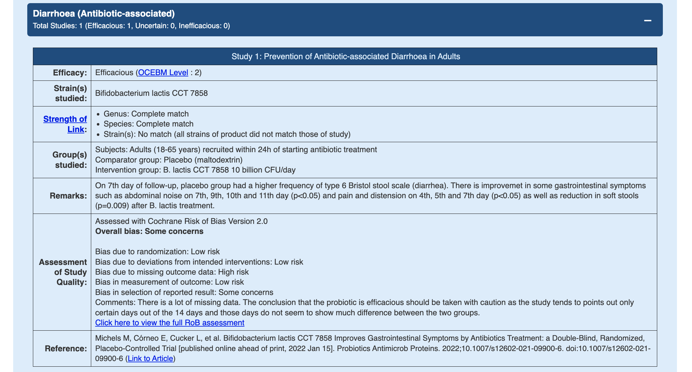

# Probiotic Web Database

## Project Introduction
In healthcare, making informed decisions based on scientific studies is important, yet accessing and evaluating these studies can be challenging for individuals, including healthcare professionals (HCPs). 

This project aims to address these challenges by consolidating probiotic studies, evaluating their credibility, and presenting them in a concise and accessible format. By linking these studies to relevant probiotics, the database enables users, particularly HCPs, to quickly retrieve and assess relevant studies when recommending probiotic products. This streamlined access to evidence-based information enhances the quality and reliability of product recommendations, contributing to improved healthcare practices.

## Quick Start
- Deployed link: [Probiotic Web Database](https://dhd.digihealthdojo.com/probioticdb/index.php)

## Functional Requirements

### 1. Search for Probiotics by Indication and Age Group
- **Description:** Users can search for probiotic products for a specific indication (e.g., gastrointestinal, genitourinary, oral, respiratory, skin, others) for either treatment or prevention. They can also filter the search results based on age groups (e.g., infants, children, adults).
- **User Actions:**
  - Enter the desired indication (e.g., gastrointestinal) and select the purpose (treatment or prevention).
  - Choose the age group (e.g., adults) from the available options.
  - Click the search button to retrieve relevant probiotic products meeting the specified criteria.

### 2. Search for Specific Product Information
- **Description:** Users can search for a specific probiotic product and retrieve detailed information about the product, including its intended use, ingredients, and recommended age group.
- **User Actions:**
  - Enter the name or code of the product in the search field.
  - Click the search button to view detailed information about the product, including its uses, ingredients, and recommended age group.

### 3. Retrieve Study Details of Probiotic Strains
- **Description:** Users can retrieve relevant study details of probiotic strains contained in a product. This includes a breakdown of study details such as study type, groups studied, outcomes measured, and risk of bias assessment for informed decision-making based on evidence-based practice.
- **User Actions:**
  - Select a specific product containing probiotic strains of interest.
  - View detailed study information related to those strains, including study type, groups studied, outcomes measured, and risk of bias assessment.

### 4. Search for Products by Specific Strains
- **Description:** Users can search for products containing specific strains of probiotics.
- **User Actions:**
  - Enter the name of the probiotic strain in the search field.
  - Click the search button to retrieve products containing the specified probiotic strains.

## Website Overview
**Homepage**

**Search By Indication**

**Search By Product**

**Search By Strain**

**Search Result**

**Product Information**

**Product Study Details**

**Study Detail**

## Technologies Used
- PHP
- MySQL
- JavaScript
- HTML
- CSS

## Future Implementations

### 1. Search for Studies
Implement a feature that allows users to search for studies related to probiotics. This feature will enable users to access detailed information about studies they are interested in. This will enhance user experience by providing direct access to relevant research findings, facilitating evidence-based decision-making for healthcare professionals.

### 2. Cloud-Based Image Uploading
Transition image uploading functionality to cloud services. This will reduce the storage requirements of the application by leveraging scalable and cost-effective cloud storage solutions. 
